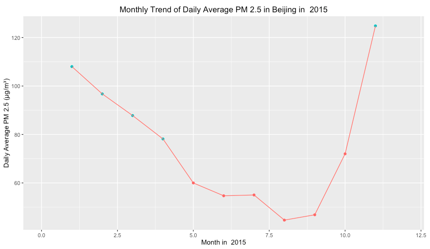

## Beijing Air Pullution


source: [bbc](http://www.bbc.com/news/world-asia-china-16665360)


--- 

## Is Air Pullution Getting Worse?

```{r, echo = FALSE, fig.width = 12}
df<- read.table("pm25annual.txt", header = TRUE)
library(ggplot2)
with(df, qplot(x = Year, y = Value, data = df, 
               ylab = "Average PM 2.5 Value (µg/m³)",
               geom = c("point", "line"),
               main = "Annual Average PM 2.5 Value in Beijing"))
```

---

## Which Season Has Most Serious Pollution?



---

## Explore More With the Shiny Application

Shiny App Link: https://leaf.shinyapps.io/bjpm25/  

Github Repo: https://github.com/lifengleaf/bjpm25


> 1. Annual change from 2008 to 2015
> 2. Monthly change every year
> 3. Whether or not exceed the offical standard?  


Data Source: [U.S. Department of State Air Quality Monitoring Program](http://www.stateair.net/web/post/1/1.html)


